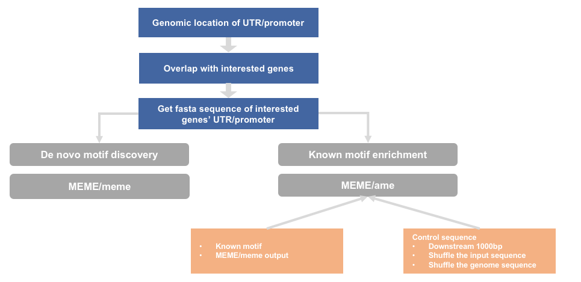

### miRNA target analysis
#### workflow

#### 1. download from database
##### miRTarBase: the experimentally validated microRNA-target interactions database
As a database, miRTarBase has accumulated more than three hundred and sixty thousand miRNA-target interactions (MTIs), which are collected by manually surveying pertinent literature after NLP of the text systematically to filter research articles related to functional studies of miRNAs. Generally, the collected MTIs are validated experimentally by reporter assay, western blot, microarray and next-generation sequencing experiments. While containing the largest amount of validated MTIs, the miRTarBase provides the most updated collection by comparing with other similar, previously developed databases.
http://mirtarbase.mbc.nctu.edu.tw/php/index.php

Chou et al. miRTarBase update 2018: a resource for experimentally validated microRNA-target interactions. Nucleic Acids Research, 2018
##### miRWalk2.0: a comphrehensive atlas of microRNA-target interactions
miRWalk2.0 is a comprehensive archive, supplying the largest available collection of predicted and experimentally verified microRNA(miRNA)-target interactions(~949 million)
http://zmf.umm.uni-heidelberg.de/apps/zmf/mirwalk2/index.html

Dweep, H et al. miRWalk2.0: a comprehensive atlas of microRNA-target interactions, Nature Methods, 2015.

#### 2. prediction by bioinformatics tools
#### miRanda
```
miranda miRNA.fa target_sequence.fa -strict >strict.output
```
